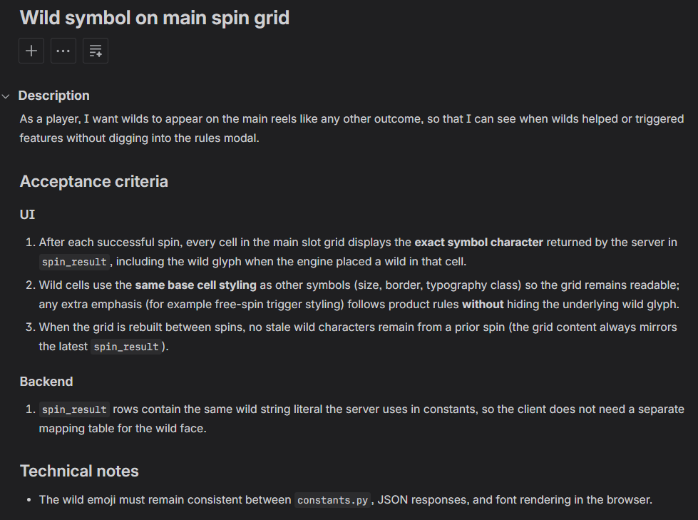
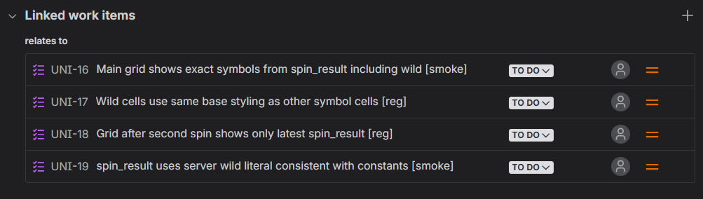
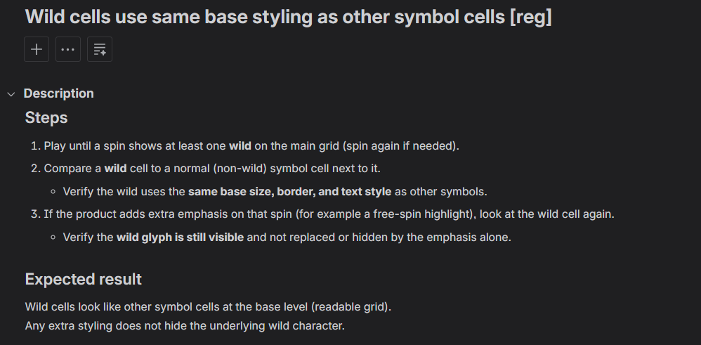
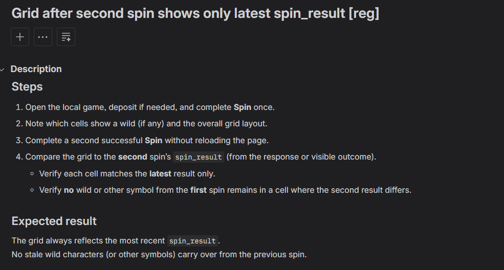
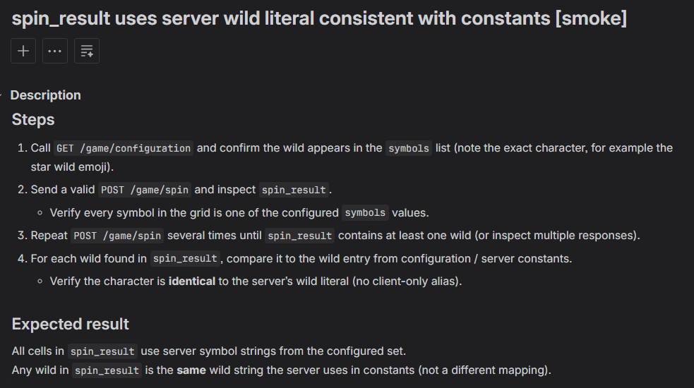
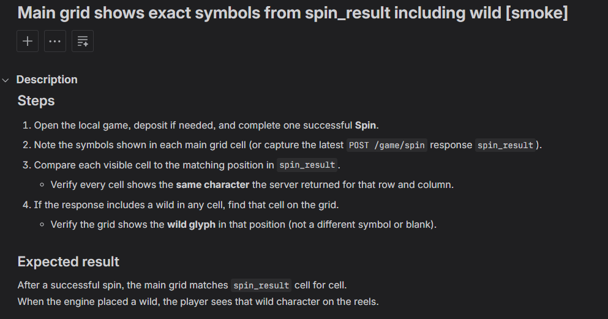

# Jira test cases — quick start

How to use **test-cases-jira-skill** with **Atlassian MCP Server** in Cursor. This skill is **standalone**—it does not depend on any other test-case skill.

## 1. One-time setup (you)

1. **Local config (not in Git):**
   ```bash
   cp .cursor/skills/test-cases-jira-skill/jira-config.example.json \
      .cursor/skills/test-cases-jira-skill/jira-config.local.json
   ```
   Edit `jira-config.local.json`:
   - `cloudId` — from `getAccessibleAtlassianResources` (MCP) or your Atlassian admin
   - `siteUrl` — `https://YOUR_SITE.atlassian.net`
   - `projectKey` — e.g. `PROJ`
   - `testCaseIssueTypeId` — from Jira project issue types (for field metadata calls)

2. In Cursor: Set up **Atlassian MCP Server** and sign in to your site by following the [Official Documentation](https://support.atlassian.com/atlassian-rovo-mcp-server/docs/setting-up-ides/).

⚠️ **Subscription Disclaimer**

*Important:* This integration requires Atlassian Rovo. By connecting your site, you may be automatically enrolled in a 30-day free trial. You must manually cancel this trial before it ends to avoid being charged a recurring monthly fee. Please check your Atlassian billing settings immediately after connection to confirm your trial status.

3. In Jira, put **acceptance criteria** in the **Story** description.

4. Confirm you can create **Test Case** issues manually in your project.git status

Auth stays in Cursor MCP—no API token in the repo.

## 2. What the agent does

```text
You:  Write Jira test cases for PROJ-7
      (or paste https://YOUR_SITE.atlassian.net/browse/PROJ-7)

Agent:
  1. Read jira-config.local.json
  2. getJiraIssue(PROJ-7)     → read AC from description
  3. Draft cases (checklist Steps + Expected result per SKILL.md)
  4. createJiraIssue         → type "Test Case", Summary + Description
  5. createIssueLink         → link story ↔ test case
  6. Reply with browse URLs
```

## 3. Where content goes in Jira

| Part | Jira field |
|------|------------|
| Title (with `[smoke]` / `[reg]`) | **Summary** |
| Steps + Expected result | **Description** (see `template.md` and `SKILL.md`) |

## 4. How to ask in chat

- `@.cursor/skills/test-cases-jira-skill/` write test cases for **PROJ-7**
- Write Jira test cases for `https://YOUR_SITE.atlassian.net/browse/PROJ-7`

## 5. See linked test cases in Jira

Open the **Story** → **Linked issues** (or your configured link type, e.g. **Relates**).

## 6. Optional improvements later

- Custom fields **Steps** / **Expected result** → add `customfield_…` IDs to `jira-config.local.json`
- **Tests** link type in Jira admin
- **Parent** hierarchy for Test Cases under stories

## 7. Example

**Story:**

**Linked test cases:**

**Test case:**

**Test case:**

**Test case:**

**Test case:**
